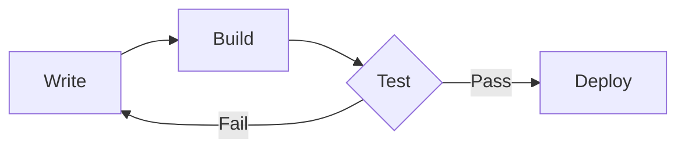

+++
title = 'Theme Guide'
date = '2025-10-26'
draft = false
tags = ['guide','theme','mermaid','math','shortcodes']
translationKey = 'quick-start'
+++

This post walks through what **hugo-trainsh** can render — headings, code, tables, diagrams, math, images, and more.



## Three Theme Modes

Click the toggle in the header to cycle through:

1. **Retro** (gamepad) — NES deep-blue background, pixel font headings, 8-bit dialog borders
2. **Light** (sun) — clean, modern light palette
3. **Dark** (moon) — comfortable for night reading

## Writing

Regular Markdown works as expected. **Bold text** stands out in gold under retro mode, and *italic text* stays readable. You can link to [any page](/) and the style adapts per theme.

> Blockquotes get a distinct cyan border in retro mode, making them easy to spot inside long articles.

---

## Code

Fenced code blocks get syntax highlighting, a copy button, and a soft-wrap toggle:

```python
from datetime import date

def greet(name: str) -> str:
    return f"Hello, {name}! Today is {date.today()}."

print(greet("world"))
```

Inline code like `hugo server` is styled too.

## Tables

| Command | Description |
|---|---|
| `hugo server` | Start local dev server |
| `hugo` | Build static site |
| `hugo new posts/hello.md` | Create a new post |

## Diagrams

Mermaid diagrams render inline:



## Math

$$E = mc^2$$

## Images

Click to open the lightbox:


## Tags




